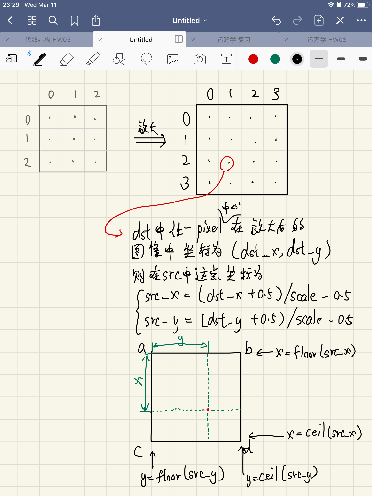
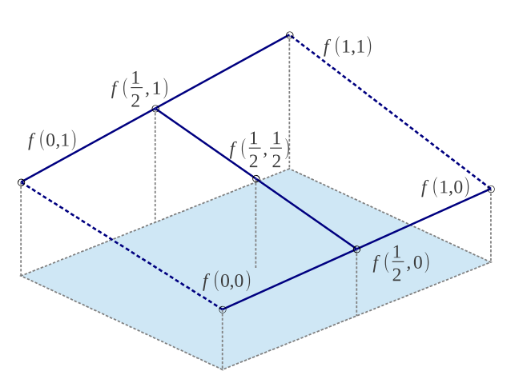
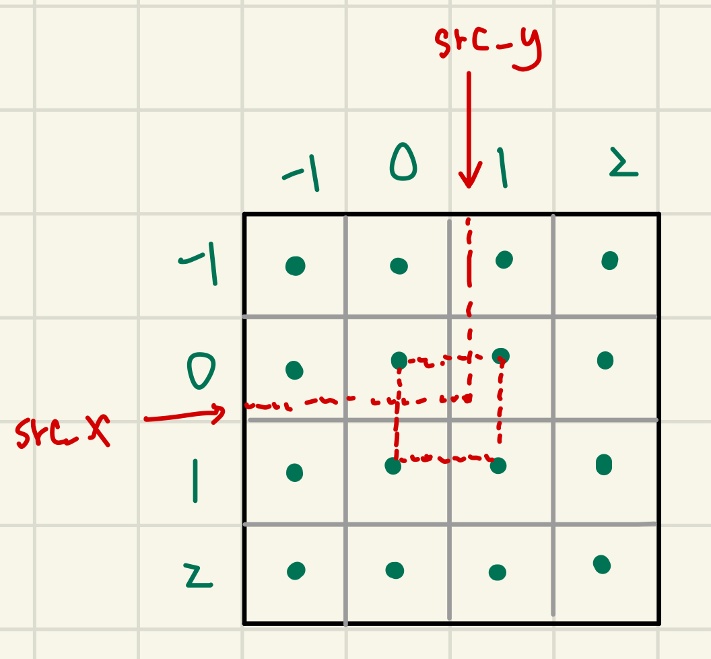
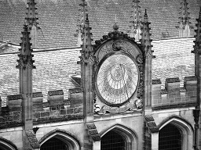

# 《数字图像处理》第一次编程作业

**Notice:** 数学公式在 Typora 中正常显示，需开启 `Markdown 扩展语法` 中的 `内联公式` （重新启动 Typora 生效）。

## 三种图像插值算法的数学原理

设放大倍数为 `scale`, 以下选用 `3x3` 的假想图片做示例。

图片放大后插值的数学背景大致如下：

显然 `src_x`, `src_y` 一般不是正整数，数字图像仅存储整数坐标处的数值，插值算法要做的就是用原图像估计 `(src_x,src_y)` 处的数值，这个数值同时也是目标图像 `(dst_x,dst_y)` 处的数值。

有下面三种常用的插值方法

### 最近邻内插

顾名思义，就是把最接近 `(src_x,src_y)` 的整数坐标的数值作为此处的数值。

### 双线性内插

`a`, `b`, `c`, `d` 和 `x`, `y` 的含义见上图。

把 `a`, `b`, `c`, `d` 四个像素中心点之间的正方形图像区域看作线性的，即可用 `x`, `y` 的比例关系计算 `(src_x,src_y)` 处的数值。

设 `a`, `b`, `c`, `d` 四点的数值为 $f(0,0)$, $f(0,1)$, $f(1,0)$, $f(1,1)$, 则

$$\begin{aligned}
    f(x,0)&=(1-x)f(0,0)+xf(1,0) \\
    f(x,1)&=(1-x)f(0,1)+xf(1,1) \\
    f(x,y)&=(1-y)f(x,0)+yf(x,1) \\
        &=(1-y)[(1-x)f(0,0)+xf(1,0)]+y[(1-x)f(0,1)+xf(1,1)] \\
        &=(1-x)(1-y)f(0,0)+y(1-x)f(0,1)+x(1-y)f(1,0)+xyf(1,1)
\end{aligned}$$

下图是一个直观展示。

### 双三次内插

双三次内插可以更好拟合图像变化较大区域。

设 `(src_x,src_y)` 在上图中红框内，图像数值在上图中 `4x4` 的矩形区域内近似为

$$f(x,y)=\sum_{i=0}^3\sum_{j=0}^3 a_{ij} x^i y^j$$

方便起见，`(floor(src_x),floor(src_y))` 点设为 $(x,y)=(0,0)$ 点。

$f(x,y)$ 有 16 个待定参数，我们取 

$$\begin{bmatrix}f(0,0)&f(0,1)&f_{y}(0,0)&f_{y}(0,1)\\f(1,0)&f(1,1)&f_{y}(1,0)&f_{y}(1,1)\\f_{x}(0,0)&f_{x}(0,1)&f_{xy}(0,0)&f_{xy}(0,1)\\f_{x}(1,0)&f_{x}(1,1)&f_{xy}(1,0)&f_{xy}(1,1)\end{bmatrix}$$

这 16 个值来确定参数，其中

$$\begin{aligned}
    f_x(i,j)&=\cfrac{f(i+1,j)-f(i-1,j)}{2}\\
    f_y(i,j)&=\cfrac{f(i,j+1)-f(i,j-1)}{2}\\
    f_{xy}(i,j)&=\cfrac{f_x(i,j+1)-f_x(i,j-1)}{2}\\
        &=\cfrac{f_y(i+1,j)-f_y(i-1,j)}{2}\\
        &=\cfrac{f(i+1,j+1)+f(i-1,j-1)-f(i+1,j-1)-f(i-1,j+1)}{4}
\end{aligned}$$

经计算得

$$\begin{bmatrix}a_{00}&a_{01}&a_{02}&a_{03}\\a_{10}&a_{11}&a_{12}&a_{13}\\a_{20}&a_{21}&a_{22}&a_{23}\\a_{30}&a_{31}&a_{32}&a_{33}\end{bmatrix}
=
\begin{bmatrix}1&0&0&0\\0&0&1&0\\-3&3&-2&-1\\2&-2&1&1\end{bmatrix}
\begin{bmatrix}f(0,0)&f(0,1)&f_{y}(0,0)&f_{y}(0,1)\\f(1,0)&f(1,1)&f_{y}(1,0)&f_{y}(1,1)\\f_{x}(0,0)&f_{x}(0,1)&f_{xy}(0,0)&f_{xy}(0,1)\\f_{x}(1,0)&f_{x}(1,1)&f_{xy}(1,0)&f_{xy}(1,1)\end{bmatrix}
\begin{bmatrix}1&0&-3&2\\0&0&3&-2\\0&1&-2&1\\0&0&-1&1\end{bmatrix}$$

$f(x,y)$ 可以写为矩阵形式

$$f(x,y)=\begin{bmatrix}1&x&x^{2}&x^{3}\end{bmatrix}\begin{bmatrix}a_{00}&a_{01}&a_{02}&a_{03}\\a_{10}&a_{11}&a_{12}&a_{13}\\a_{20}&a_{21}&a_{22}&a_{23}\\a_{30}&a_{31}&a_{32}&a_{33}\end{bmatrix}\begin{bmatrix}1\\y\\y^{2}\\y^{3}\end{bmatrix}$$

以上计算都能通过线性代数库方便地计算。

## 效果对比

测试图片如下：

|  |  |  |
| :-------------------: | :--------------------: | :----------------: |
|    `building.jpg`     |    `cameraman.jpg`     |    `lenna.jpg`     |

### scale=0.5

|  |  |  |
| :----------------------------: | :----------------------------: | :----------------------------: |
|      `building_0.5_n.jpg`      |      `building_0.5_b.jpg`      |      `building_0.5_c.jpg`      |

|  |  |  |
| :-----------------------------: | :-----------------------------: | :-----------------------------: |
|      `cameraman_0.5_n.jpg`      |      `cameraman_0.5_b.jpg`      |      `cameraman_0.5_c.jpg`      |

|  |  |  |
| :-------------------------: | :-------------------------: | :-------------------------: |
|      `lenna_0.5_n.jpg`      |      `lenna_0.5_b.jpg`      |      `lenna_0.5_c.jpg`      |

可以看到最临近内插法生成的图像明显粗糙，锯齿较多，在 `building.jpg` 中有严重的摩尔纹。

双线性内插和双三次内插生成的图像区别较小，双三次内插生成的图像更锐利，两者都没有明显的锯齿。

### scale=3

每组图片从上至下依次为最邻近内插、双线性内插、双三次内插。

可以看到最近邻内插法得到的图像有更严重的锯齿现象，屋顶细节和人的头发细节被严重破坏。

双线性内插和双三次内插生成的图像区别较小，双三次内插生成的图像更锐利，屋顶细节保留更充分。但两者在斜直线上也没有很好地应对锯齿问题。
