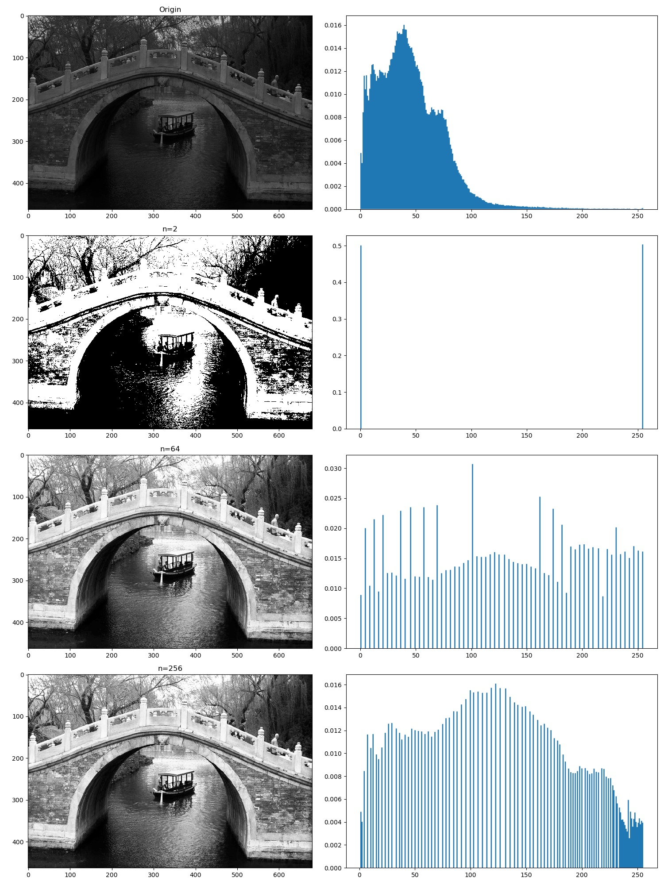
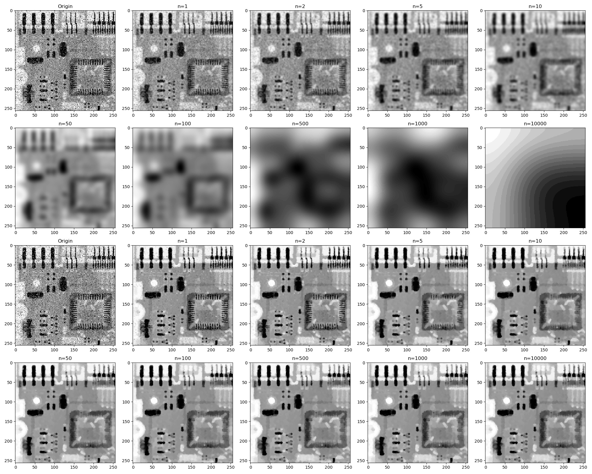
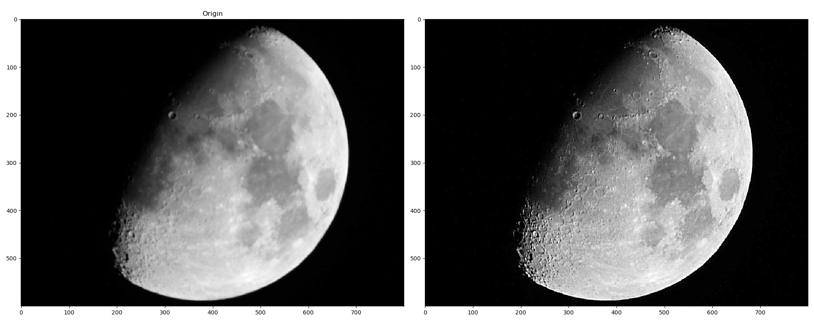

# 《数字图像处理》第一次编程作业

**Notice:** 数学公式在 Typora 中正常显示，需开启 `Markdown 扩展语法` 中的 `内联公式` （重新启动 Typora 生效）。

## 直方图均衡

直方图均衡的算法参考书上。

先统计每种灰度出现的频率

$$p_r(r_k)=\cfrac{n_k}{MN}\ \ \ \ k=1,2,\cdots,L-1$$

再计算

$$s_k=(L-1)\sum_{j=0}^k p_r(r_j)$$

$s_k$ 即为原灰度值 $r_k$ 经过直方图均衡后的新灰度值。

这个灰度值是 $[0,255]$ 上的实数值，可以取非整数。为此，我们还需要把灰度值离散化。

设离散化后灰度值一共有 $P$ 种取值，把 $s_k$ 线性映射到 $[-0.5, P+0.5]$ 的线性区间内，然后用“最接近的整数”表示原来的值，再把值等比例映射到 $[0,255]$ 区间内，再取一次“最接近的整数”，即可完成指定灰度阶数的离散化。

灰度阶数 `n=2`, `n=64`, `n=256` 的直方图均衡结果如下，右侧是灰度直方图。

可以看出直方图均衡明显使图片的对比度提高，观感变好，但 2 灰阶使图像严重失真。相比之下 64 灰阶和 256 灰阶粗看几乎没有差异，只有细看才能感到 256 灰阶有更好的层次感。

## 图像平滑

采用卷积运算，分别进行`均值图像平滑`和`中值图像平滑`，分别取滤波次数 `n=1`, `n=2`, `n=5`, `n=10`, `n=50`, `n=100`, `n=500`, `n=1000`, `n=100000`, 来观察两种滤波方法随着滤波次数的增长的不同表现。结果如下：

上图中均值平滑 `n=500`, `n=1000`, `n=10000` 的显示有一些问题（似乎是 `matplotlib` 的缘故），实际的这三张图片如下：

|  |  |  |
| :----------------------------------------: | :-----------------------------------------: | :------------------------------------------: |
|                   n=500                    |                   n=1000                    |                   n=10000                    |

可以看出，均值平滑的去噪声效果不如中值平滑，且均值平滑随着滤波次数的增长，图像会越来越模糊，当 $n\to\infty$ 时，图像收敛为一片均匀的灰色。而中值平滑随着滤波次数的增长，最后会收敛到一个稳定的图像，去噪声效果也较好。

## 图像锐化

使用拉普拉斯算子实现图像锐化，

即用算子

$$\begin{bmatrix}-1&-1&-1\\-1&8&-1\\-1&-1&-1\end{bmatrix}$$

和图像进行卷积运算。需要在图像四边补上一个边缘像素，以保证卷积运算后图像大小不会改变。

效果如下：

可以看出有明显的锐化效果，月球的环形山边缘清晰可见。但图像中多了一些很淡的横向与竖向条纹，似乎此锐化算法会引入这样的额外噪声。
