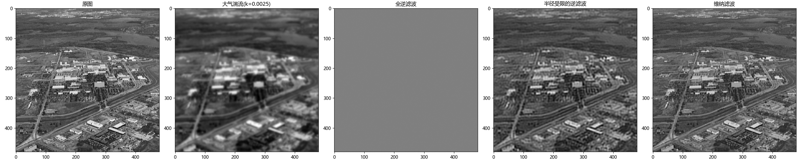
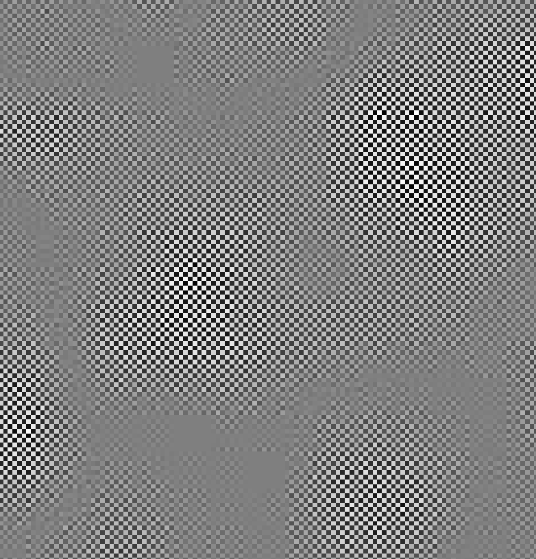
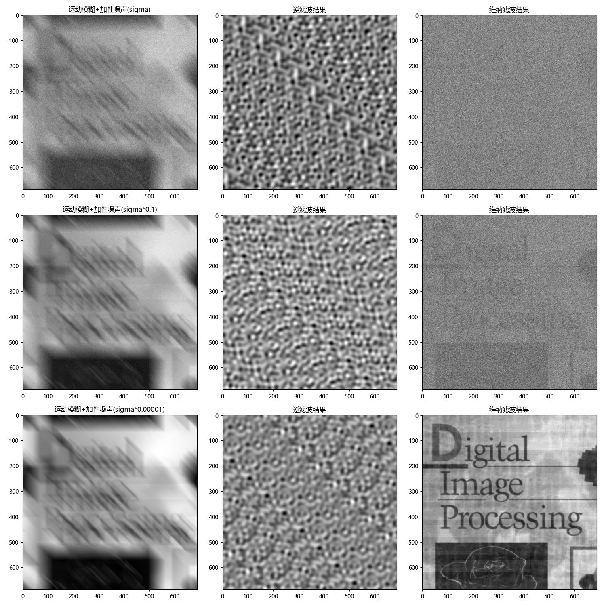

# 《数字图像处理》第三次编程作业

**Notice:** 数学公式在 Typora 中正常显示，需开启 `Markdown 扩展语法` 中的 `内联公式` （重新启动 Typora 生效）。

## 两种图像退化

设初始图象为 $f(x,y)$, 这是空间域，在其上进行线性退化运算为

$$g(x,y)=h(x,y)* h(x,y)+\eta(x,y)$$

为了简化计算，利用傅里叶变化可以将乘法和卷积互相转化的性质，对 $f,g,h,\eta$ 分别进行傅里叶变化得 $F(u,v), G(u,v), H(u,v), N(u,v)$, 这称之为频率域。

图像的退化过程变为

$$F(u,v)=H(u,v)F(u,v)+N(u,v)$$

编程时使用 `numpy.fft` 包即可快速进行傅里叶变换和反变换。

以下是两种退化的 $H(u,v)$.

### 大气折射退化

$$H(u,v)=\exp \left(-k(u^2+v^2)^{5/6}\right)$$

### 运动退化

图像朝着 $(a,b)$ 向量方向运动 $T$ 时间产生的退化。

$$H(u,v)=T \cfrac{\sin [\pi(ua+vb)]}{\pi(ua+vb)} \exp (-j\pi(ua+vb))$$

## 两种重建滤波

从已退化图像的 $G(u,v)$ 和 $H(u,v)$ 重建 $F(u,v)$ 的估计 $\hat{F}(u,v)$ 称之为重建滤波。以下是两种重建方式。

### 逆滤波

忽略 $N(u,v)$, 则可直接用除法得

$$\hat{F}(u,v)=\cfrac{G(u,v)}{H(u,v)}=F(u,v)+\cfrac{N(u,v)}{H(u,v)}$$

这种方法的缺点是 $H(u,v)$ 接近 $0$ 时，$N(u,v)$ 会带来较大误差。解决方法是使用 Butterworth 低通滤波器以限制滤波频率，即再进行一次滤波消除高频噪声

$$H(u,v)=\cfrac{1}{1+[D(u,v)/D_0]^{2n}}$$

$D_0$ 为截止半径，$n$ 为阶数。

### 维纳滤波

目的是最小化 $f$ 和 $\hat{f}$ 之间的均方误差。

$$\hat{F}(u,v)=\left[ \cfrac{1}{H(u,v)} \cdot \cfrac{|H(u,v)|^2}{|H(u,v)|^2+K} \right]G(u,v)$$

## 实验结果

### 大气折射退化的重建

可以看出直接逆滤波出的图像几乎没有价值，事实上这是因为图像充满了高频噪声，将直接逆滤波图像放大后可以看到：

相邻像素的颜色变化剧烈，使整体信息淹没在了局部噪声中。

使用半径受限滤波后，重建质量得到显著提升。

维纳滤波的肉眼观感最好。

### 运动退化的重建

三个参数相同的运动退化图像中分别加入了方差为 $0.01$, $0.001$, $0.0000001$ 的高斯噪声。

由于没有正确指定参数，半径受限逆滤波的结果无用。

维纳滤波较好地消除了运动带来的拖影，但在第三幅图中仍然有一些重影现象。高斯噪声对于维纳滤波的结果质量有显著影响，噪声较多时结果几乎只有噪声。
