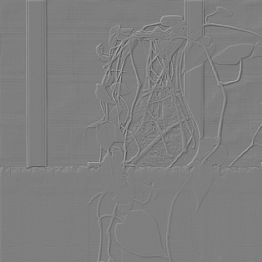
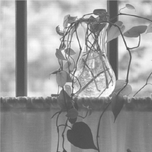
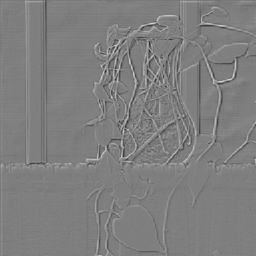
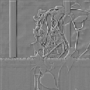
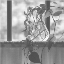
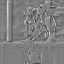

# 《数字图像处理》第四次编程作业

**Notice:** 数学公式在 Typora 中正常显示，需开启 `Markdown 扩展语法` 中的 `内联公式` （重新启动 Typora 生效）。

## 近似金字塔和残差金字塔

近似金字塔和残差金字塔产生的步骤如下：

1. 通过近似滤波器（本次实验中为高斯低通滤波器，截止频率为图像边长的一半）后，图像进行二倍下采样，得到第 $j-1$ 级近似；
2. 利用插值算法（本次实验中使用双线性插值）从第 $j-1$ 级近似产生第 $j$ 级输入图像的一个估计；
3. 计算第 2 步产生的估计和输入图像之间的差，即预测残差；
4. 重复 1~3 步。

|                近似金字塔 | 残差金字塔                 |
| ------------------------: | :------------------------- |
|  |  |
|  |  |
|  |  |
|  |  |

可以看出，高分辨率的残差图像适合分析小尺寸/单个物体的特性，而低分辨率的残差金字塔适合全局特性的分析。

## 二维快速小波变换与边缘检测

### 二维快速小波变换

### 边缘检测
