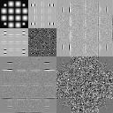

# 《数字图像处理》第四次编程作业

**Notice:** 数学公式在 Typora 中正常显示，需开启 `Markdown 扩展语法` 中的 `内联公式` （重新启动 Typora 生效）。

## 近似金字塔和残差金字塔

近似金字塔和残差金字塔产生的步骤如下：

1. 通过近似滤波器（本次实验中为高斯低通滤波器，截止频率为图像边长的一半）后，图像进行二倍下采样，得到第 $j-1$ 级近似；
2. 利用插值算法（本次实验中使用双线性插值）从第 $j-1$ 级近似产生第 $j$ 级输入图像的一个估计；
3. 计算第 2 步产生的估计和输入图像之间的差，即预测残差；
4. 重复 1~3 步。

|                近似金字塔 | 残差金字塔                 |
| ------------------------: | :------------------------- |
|  |  |
|  |  |
|  |  |
|  |  |

可以看出，高分辨率的残差图像适合分析小尺寸/单个物体的特性，而低分辨率的残差金字塔适合全局特性的分析。

## 二维快速小波变换与边缘检测

### 二维快速小波变换

快速小波变换的步骤同书上，这里仅展示结果。

为了便于展示，子图像都进行了处理，将灰度值范围映射到 0~255.

可以看到，子图像 $W^H$, $W^V$, $W^D$ 分别在水平、垂直、对角线 3 个方向探测到了特征。

### 边缘检测

边缘检测基于小波变换的子图像具有的方向特异性。

把二尺度 FWT 置为 0，再进行两次反变换，重建的图像可以显现出剩余的子图所保留的所有方向上的边缘特征。

把所有尺度下的 $W^V$ 置为 0，二尺度 FWT 也置为 0，再进行两次反变换重建，即可得到保留水平方向边缘的图像。

