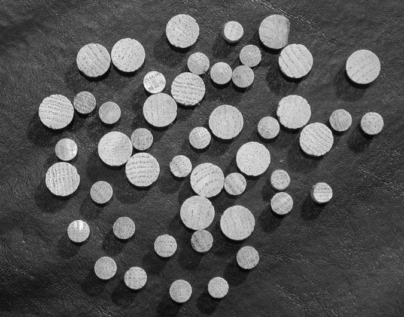

# 《数字图像处理》第五次编程作业

**Notice:** 数学公式在 Typora 中正常显示，需开启 `Markdown 扩展语法` 中的 `内联公式` （重新启动 Typora 生效）。

实验代码见 `main.py`.

## 二值形态学

二值形态学的基本操作为**膨胀**和**腐蚀**，定义如下：

$B$ 对 $A$ 的膨胀定义为

$$A\oplus B=\{z\mid (\hat{B})_z \bigcap A \ne \empty \}$$

$B$ 对 $A$ 的腐蚀定义为

$$A\ominus B=\{z\mid (\hat{B})_z \subseteq A \}$$

膨胀可以形象化理解为结构元的中心点始终在图像亮区中移动时，结构元所能覆盖到的全部区域。腐蚀操作可以理解为结构元始终全部在图像亮区中移动时，结构元中心点所能覆盖的全部区域。

在膨胀和腐蚀的基础上，可以定义开操作与闭操作：

$$A\circ B=(A\ominus B)\oplus B$$
$$A\cdot B=(A\oplus B)\ominus B$$

长字符提取的算法如下：

1. 首先使用特定形状的结构元进行腐蚀操作（本实验中为高度为 51, 宽度为 1 的条状结构元），操作之后只会留下那些纵向长度大于 51 的字符的部分残余；
2. 然后对于这些残余，进行迭代膨胀操作，每迭代一次，就用原图像进行一次异或操作, 使膨胀操作扩展的像素点被限制在一个字符内。

孔洞填充的算法如下：

1. 对原图像取反 $A'$；
2. 生成一幅和原图一样大的黑色图像，然后在其四周扩展一圈白色像素，得到 $B$;
3. 在 $B$ 上迭代进行膨胀操作，每次操作后和 $A'$ 进行一次异或操作，使 $B$ 中白色像素不会侵入到字符的位置，直到 $B$ 不再变化；
4. 对 $B$ 取反，然后去除边缘附加的一圈像素，即得到结果。

边界清除算法如下：

1. 生成一幅和原图一样大的黑色图像，然后在其四周扩展一圈白色像素，得到 $B$;
2. 在 $B$ 上迭代进行膨胀操作，每次操作后和原图像 $A$ 进行一次异或操作，使 $B$ 中白色像素始终处于边缘字符的范围中，直到 $B$ 不再变化；
3. 从 $A$ 中减去 $B$ 得到结果。

<table>
    <tr>
        <td align="center">   原图  </td>
        <td align="center">   长字符提取结果</td>
    </tr>
    <tr>
        <td align="center">    孔洞填充结果</td>
        <td align="center">    边界清除结果</td>
    </tr>
</table>

## 灰度值形态学

灰度值形态学的腐蚀、膨胀、开操作、闭操作定义如下：

腐蚀：

$$[f\ominus b](x,y)=\min_{(s,t)\in b} \{f(x+s,y+t)\}$$

膨胀：

$$[f\ominus b](x,y)=\min_{(s,t)\in b} \{f(x+s,y+t)\}$$

开操作：

$$f \circ b =(f\ominus b)\oplus b$$

闭操作：

$$f \cdot b =(f \oplus b) \ominus b$$

### 阴影纠正

阴影纠正的目的是，如果一幅图像中阴影不均匀，那么进行阈值分割时，就会有错误的分隔（如一下实验结果）。

阴影纠正的方法是顶帽变化;

$$T_{hat}(f)=f-(f \circ b)$$

其原理是，用一个结构元通过开操作从一幅图像中删除物体，然后，差操作得到一幅仅保留已删除分量的图像。

顶帽变换结果、及其变换后再进行 Otsu 阈值分割的结果如下：

<table>
    <tr align="center">
        <td align="center"> 原图</td>
        <td align="center"> 直接使用 Otsu 算法进行阈值划分的结果</td>
    </tr>
    <tr>
        <td align="center"> 进行开操作 (r=40) 的结果</td>
        <td align="center"> 顶帽变换的结果</td>
        <td align="center"> 顶帽变化后再进行 Otsu 阈值分割的结果</td>
    </tr>
</table>

### 粒度检测

粒度检测的原理是，开操作可以消除掉小于结构元尺寸的亮物体（而对于大于结构元尺寸的物体，则不会显著改变其亮度和大小），因而对于图像进行连续变化的不同尺寸的结构元的开操作，然后计算相邻尺寸结构元操作结果之间的像素差异（称之为 difference in surface areas），即可得知图片中存在哪些大小的亮物体。

为避免小噪音的干扰，在进行开操作前应该首先进行形态学平滑。

实验输出的部分图片如下：

<table>
    <tr align="center">
        <td align="center"> 原图</td>
        <td align="center"> 形态学平滑 (r=5) 的结果</td>
        <td align="center"> 开操作 (r=10) 的结果</td>
    </tr>
    <tr>
        <td align="center"> 开操作 (r=20) 的结果</td>
        <td align="center"> 开操作 (r=25) 的结果</td>
        <td align="center"> 开操作 (r=30) 的结果</td>
    </tr>
</table>

不同尺寸的结构元的开操作，其 difference in surface areas 结果如下。可以看出原图中存在两个主要尺寸的物件。

### 纹理分割

纹理分割的原理是，先用一定尺寸（大于小物件但小于大物件）的结构元进行闭（此处是白底黑物体，所以是闭操作）操作以移除小尺寸的物件，再用大于大物件间隙的结构元进行开操作以填充缝隙，最后再进行形态学梯度操作，即可获得两种尺寸物体（纹理）之间的分界线。

实验结果如下：

<table>
    <tr align="center">
        <td align="center"> 原图</td>
        <td align="center"> 用闭操作 (r=30) 移除小物体</td>
    </tr>
    <tr>
        <td align="center"> 用开操作 (r=60) 填充缝隙</td>
        <td align="center"> 分隔结果</td>
    </tr>
</table>