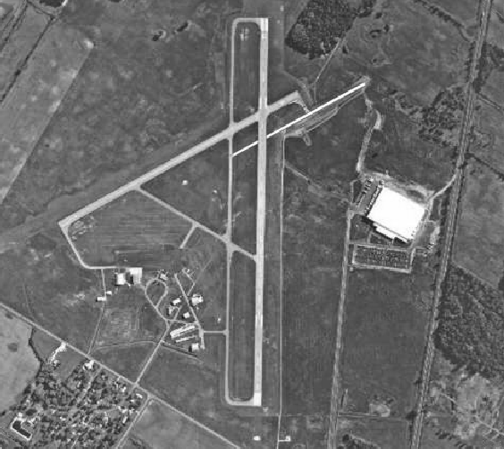
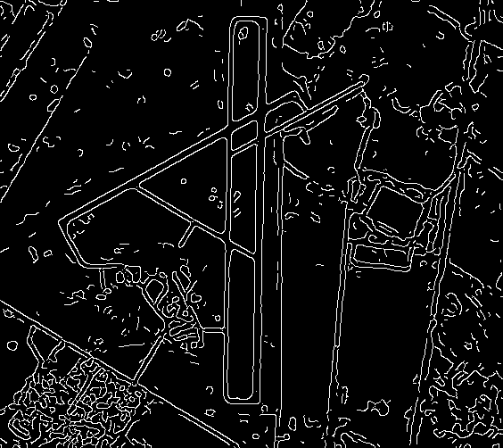
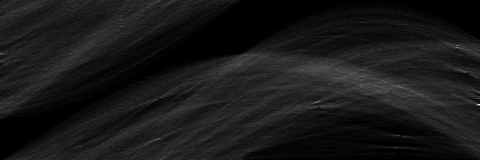
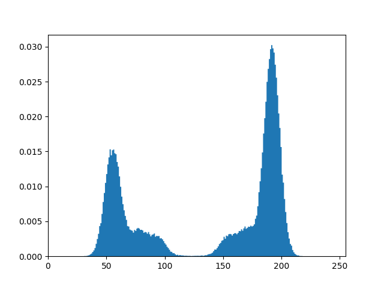
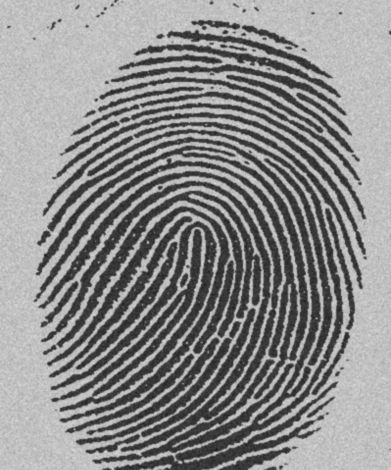
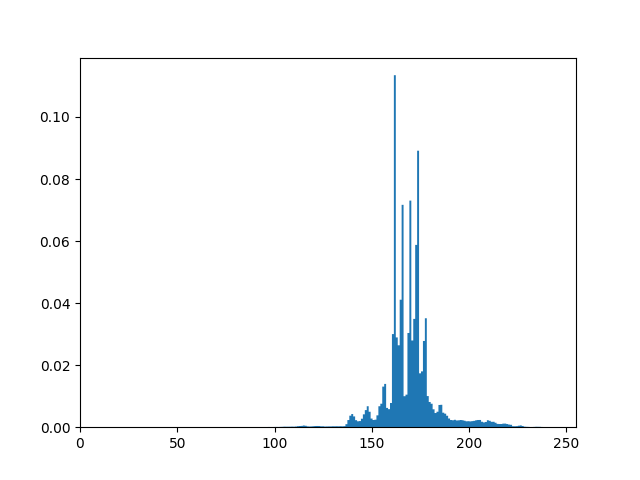
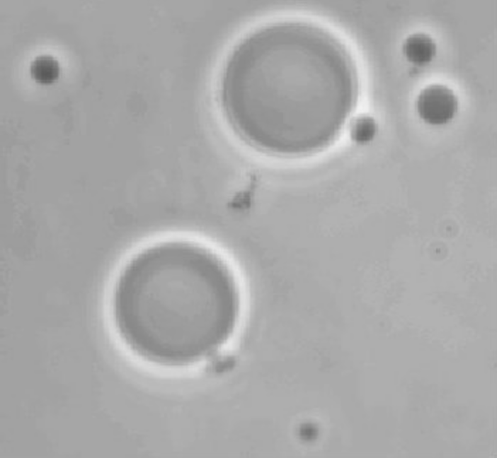
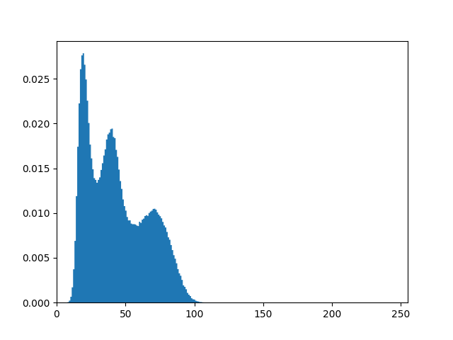
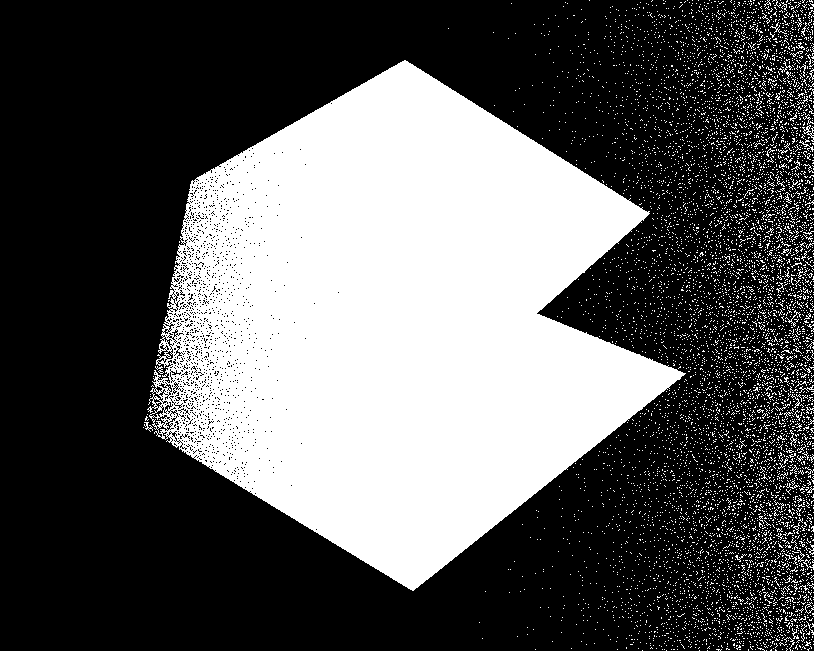
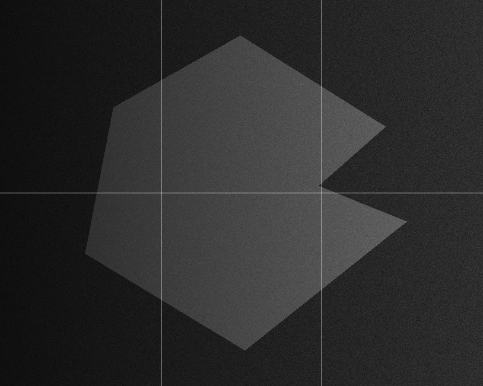

# 《数字图像处理》第五次编程作业

**Notice:** 数学公式在 Typora 中正常显示，需开启 `Markdown 扩展语法` 中的 `内联公式` （重新启动 Typora 生效）。

实验代码见 `main.py`.

## 霍夫变换

霍夫变换的算法见书上，此处不再赘述，实现的同时需要实现 Canny 变换。

以下是 Canny 变换检测到的边缘，它是 Hough 变换的输入。

以下是 Hough 变换的结果，水平方向为 $\theta$ 取值 $-90 \degree$ 到 $90 \degree$，垂直方向为 $\rho$ 取值，可以看到其中的亮点即代表较长的直线（代表有更多的点共线）。

## 阈值分割

对于以下两类界限十分明确的图像，全局迭代法是良好的方法，结果如图。

<table>
    <tr>
        <td align="center">   原图 </td>
        <td align="center">    全局迭代法的结果</td>
    </tr>
</table>

对于如下这种分类界限比较模糊的图像，肉眼难以直观找出最佳的分割阈值，全局迭代法也容易陷入困境，这时则使用 Otsu 方法自动寻找最佳阈值。

Otsu 方法原理为最大化类间方差。

<table>
    <tr>
        <td align="center">   原图 </td>
        <td align="center">    全局迭代法的结果</td>
        <td align="center">    Otsu 算法的结果</td>
    </tr>
</table>

对于以下含有不均匀阴影的图形，全局迭代法和 Otsu 法效果都欠佳（如图所示），于是使用分块 Otsu 方法，把图片分成 6 块，每块单独进行阈值分割，可以获得更好的效果。

<table>
    <tr>
        <td align="center">   原图 </td>
        <td align="center">    全局迭代法的结果</td>
    </tr>
    <tr>
        <td align="center">   Otsu 算法的结果 </td>
        <td align="center">    分块</td>
        <td align="center">    分块 Otsu 算法的结果</td>
    </tr>
</table>
