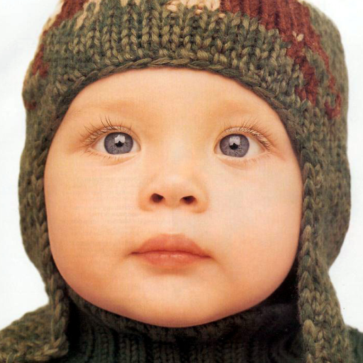

# 《数字图像处理》第七次编程作业 —— Huffman 编码

**Notice:** 数学公式在 Typora 中正常显示，需开启 `Markdown 扩展语法` 中的 `内联公式` （重新启动 Typora 生效）。

实验代码见 `main.py`.

## 算法

Huffman 编码是一种基于出现频率的变长压缩编码方式，即相对于等长编码，可以给出现频率高的元素一个较短的编码，而给出现频率低的元素较长的编码。它的算法构造是基于二叉树的，如下：

1. 按出现频率给各元素排序；
2. 取出其中出现频率最小的两个节点，把它们组合成一个新节点的左右节点，新节点的出现频率为子节点之和；
3. 把新节点按照排序插入到原节点列表；
4. 重复 2,3, 直到列表中只有一个节点，即为根节点。

从根节点下溯到叶节点（0 向左，1 向右），可以获得编码对应的叶节点（即为元素名称）反之上溯则可以根据元素名称获得编码。

## 实验结果

`train` 中所有图片的灰度频率直方图为：


根据这种频率分布建立的 Huffman 编码为（运行程序即可打印出结果）：

```
0:	101000010
1:	101001011
2:	110101010
3:	00101001
4:	00101000
5:	110101011
6:	101011110
7:	00011111
8:	00100101
9:	00101010

......

245:	010101011
246:	001011000
247:	001001110
248:	001001111
249:	001011001
250:	1010100111
251:	001000100
252:	1010100110
253:	001000101
254:	111110010
255:	010111
```

`test` 中各个图像经过编码后的结果为：

| 图像                       | 直方图                            | 原大小 (KB) | 压缩后大小 (KB)  | 压缩率 (%)         |
| -------------------------- | --------------------------------- | ----------- | ---------------- | ------------------ |
|       |       | 256.0       | 258.22314453125  | 100.86841583251953 |
|       |       | 81.0        | 81.335693359375  | 100.41443624614197 |
|  |  | 64.0        | 63.59326171875   | 99.36447143554688  |
|       |       | 76.5625     | 78.61181640625   | 102.6766581632653  |
|      |      | 76.59375    | 76.0230712890625 | 99.2549278355773   |

可以看到压缩效果非常不明显，甚至有图像的大小反而增大了。

通过比较训练集的灰度频率直方图和测试集可知，两者的高频分布、低频分布的灰度值接近时，可以获得压缩效果。简单的 Huffman 编码在图像压缩领域是不实用的。
